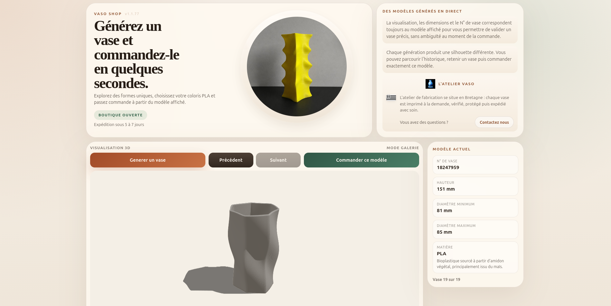
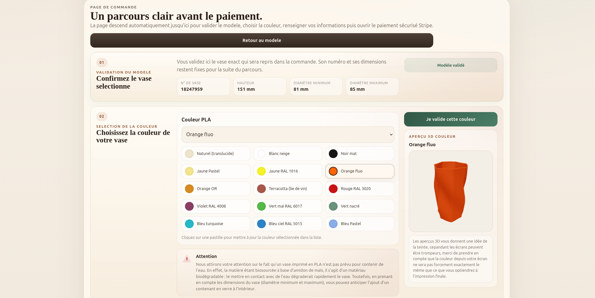
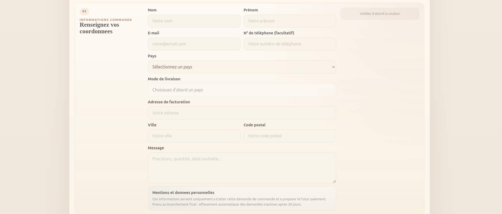
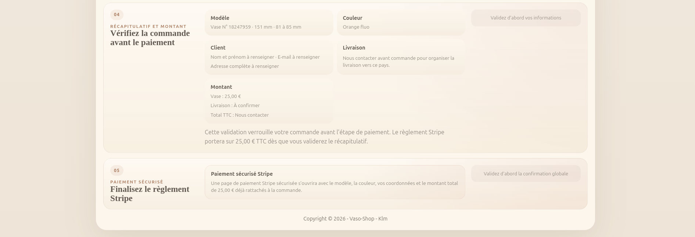
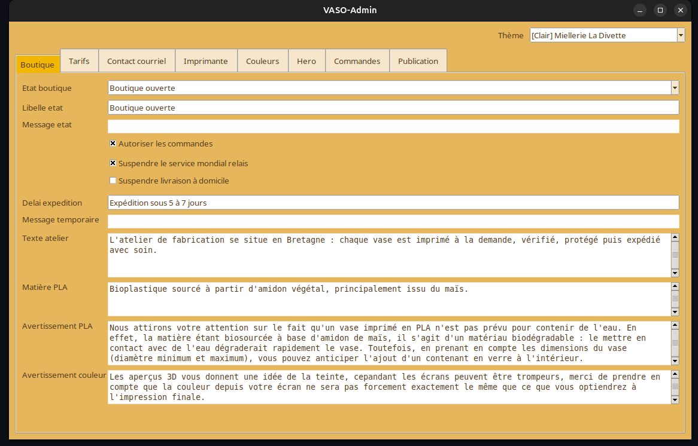

# Vaso Shop

**Vaso Shop** est la boutique web de l'atelier **Vaso**.

Le site permet de parcourir des vases générés en direct, d'en retenir un modèle précis, de
choisir un coloris PLA, puis de passer commande via **Stripe Checkout**.

Le projet inclut aussi **VASO-Admin**, une interface locale pour piloter la boutique, ajuster les
textes, les tarifs, les couleurs, les livraisons et consulter les commandes payées.

---

## Accès en ligne

Boutique publique :

`https://mrklm.github.io/vaso-shop/`

Backend léger :

- fonctions Netlify pour Stripe
- webhook Stripe
- notifications Discord
- historique privé des commandes

---

## Aperçu







---

## Fonctionnalités

- génération et navigation entre plusieurs modèles de vases
- visualisation 3D du modèle courant
- choix de la couleur PLA
- récapitulatif détaillé avant paiement
- paiement Stripe Checkout
- pages de retour après paiement ou annulation
- prise en charge de plusieurs modes de livraison selon le pays
- suspension temporaire des modes de livraison depuis `VASO-Admin`
- notifications Discord automatiques après paiement validé
- stockage privé des commandes via Netlify Blobs
- consultation des commandes dans `VASO-Admin`

---

## Architecture

```text
vaso-shop
├─ src/                     # boutique React / Vite
├─ public/                  # assets publics + config boutique JSON
├─ netlify/functions/       # Stripe, Discord, commandes
├─ admin/                   # VASO-Admin (outil local Python/Tkinter)
├─ screenshots/
├─ electron/                # emballage desktop éventuel
├─ netlify.toml
├─ package.json
└─ README.md
```

---

## Développement

### 1. Cloner le dépôt

```bash
git clone https://github.com/mrklm/vaso-shop.git
cd vaso-shop
```

### 2. Installer les dépendances

```bash
npm install
```

### 3. Lancer la boutique en local

```bash
npm run dev
```

Puis ouvrir :

`http://localhost:5173`

### 4. Build production

```bash
npm run build
```

---

## VASO-Admin

`VASO-Admin` est l'interface locale de gestion de la boutique.

Lancement :

```bash
python3 admin/vaso_admin.py
```

Il permet notamment :

- d'éditer `public/config/shop-config.json`
- de modifier les textes de la boutique
- de régler les tarifs
- de piloter les couleurs PLA
- de gérer les images hero
- de suspendre temporairement certains modes de livraison
- de consulter les commandes payées
- de publier les changements vers GitHub

Plus de détails :

[`admin/README.md`](admin/README.md)

---

## Déploiement

Architecture actuelle :

- **GitHub Pages** publie la boutique publique
- **Netlify** héberge uniquement le backend léger

Netlify sert à :

- créer les sessions Stripe Checkout
- recevoir le webhook Stripe
- envoyer les notifications Discord
- stocker l'historique privé des commandes

---

## Technologies

- React
- Vite
- TypeScript
- Three.js / React Three Fiber
- Zustand
- Netlify Functions
- Stripe
- Python / Tkinter pour `VASO-Admin`

---

## Licence

Projet distribué sous licence **GNU GPL v3**.

Voir le fichier [LICENSE](LICENSE).

---

## Contact

`clementmorel@free.fr`
